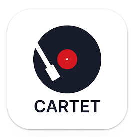
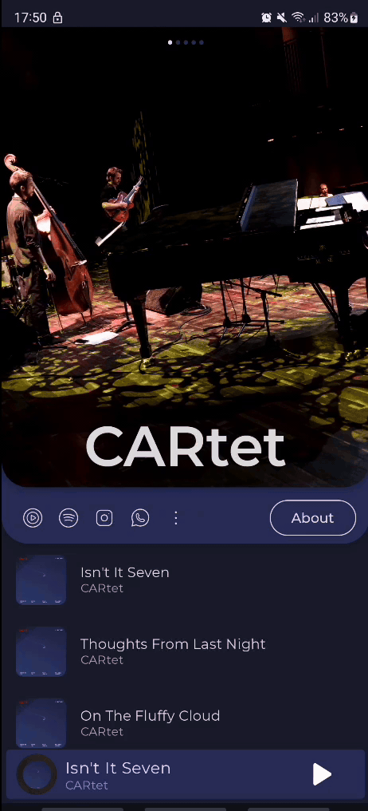
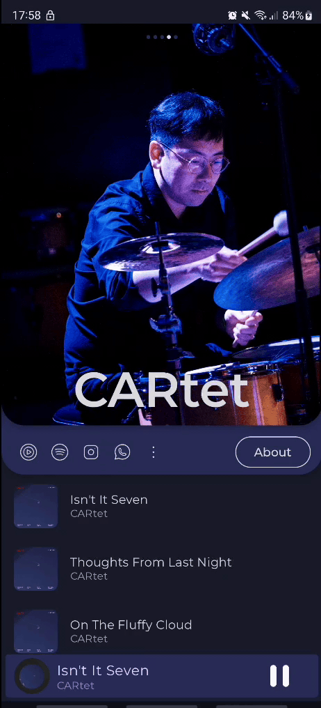
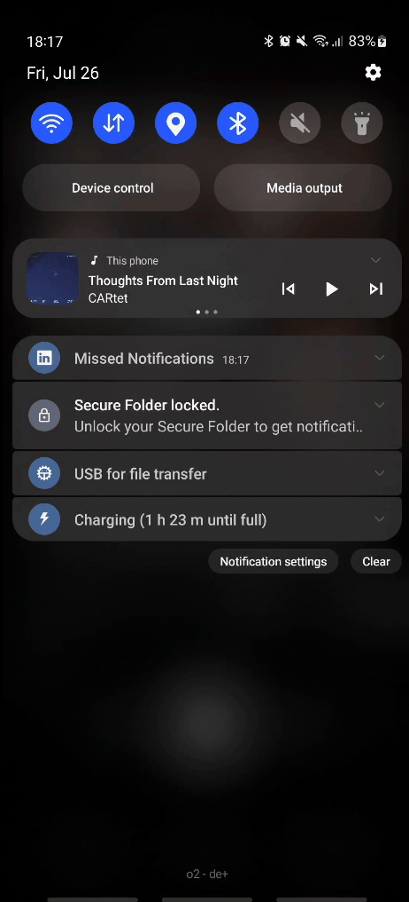
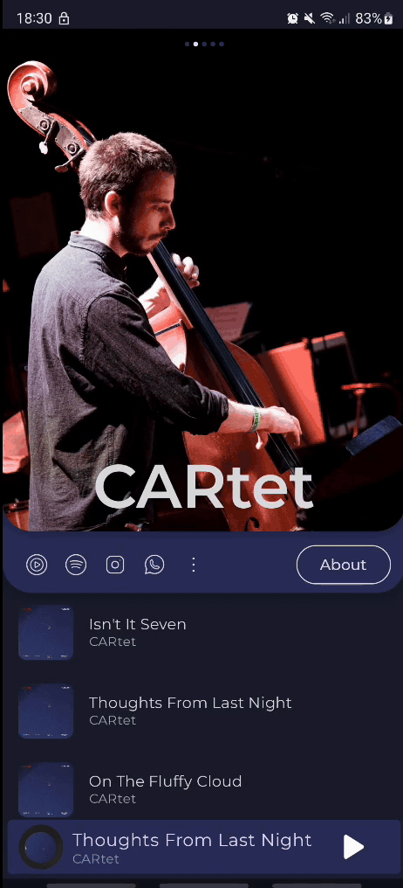
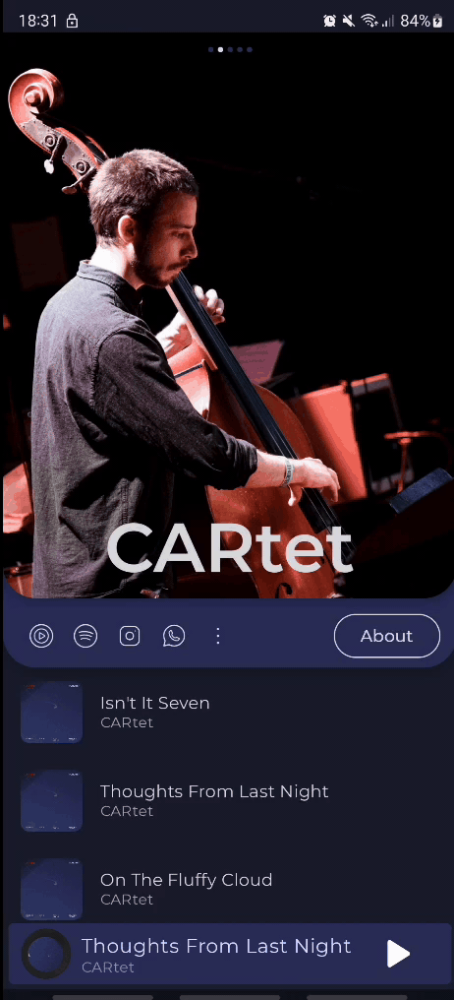

  <a href="https://play.google.com/store/apps/details?id=com.euntaek.mymusic.cartet">
    
    <h1 align="center">My Music</h1>
  </a>

## Tech stack base
* Kotlin
* [Kotlin Coroutines](https://kotlinlang.org/docs/coroutines-overview.html)
* [Kotlin DSL](https://developer.android.com/build/migrate-to-kotlin-dsl)
* [Material 3](https://m3.material.io/)
* [Figma](https://www.figma.com/design/VAGLYYZX2V2CibaQPpIIhy/Cartet-Icon?node-id=0-1&t=uX0jULGXNlWc75ds-0)
* [Firebase Realtime Database](https://firebase.google.com/docs/database)
* [Exoplayer](https://github.com/google/ExoPlayer)
* White label
* Patterns
    - MVI
    - Clean Architecture
* [API Guidelines for @Composable components](https://android.googlesource.com/platform/frameworks/support/+/androidx-main/compose/docs/compose-component-api-guidelines.md)
* [JetPack Compose](https://developer.android.com/jetpack/compose?gclid=Cj0KCQiAjMKqBhCgARIsAPDgWlyVg8bZaasX_bdQfYrAXsuDQ6vD-2SmFcTv34Fb-jLQxgGqPD7UxKgaAso5EALw_wcB&gclsrc=aw.ds)
* [Compose Destinations](https://github.com/raamcosta/compose-destinations) / [Documentation](https://composedestinations.rafaelcosta.xyz/)
* [Gradle Version Catalogs (toml)](https://developer.android.com/build/migrate-to-catalogs)
* [Coil](https://github.com/coil-kt/coil)
* [Timber Client logging](https://github.com/JakeWharton/timber)
* [Dependency Injection (HILT)](https://developer.android.com/training/dependency-injection/hilt-android)
* Unit testing
* JUnit5

## Screenshots
### Main screen
|  |  |  |  |
|:----------------------------------------------:|:----------------------------------------------:|:----------------------------------------------:|:----------------------------------------------:|
|                 Jacket Images                  |                   Song List                    |                 Changing Songs                 |                     Links                      |

### Music Player
|  |  |          |
|:-----------------------------------------------:|:-----------------------------------------------:|:-------------------------------------------------------:|
|                  Playing Song                   |                   Controller                    |                   Music Notification                    |

### About
|  |  |
|:----------------------------------------:|:----------------------------------------:|
|             From main screen             |                About page                |

### Setting
|  |  |
|:------------------------------------------:|:------------------------------------------:|
|                  Sharing                   |                   Update                   |